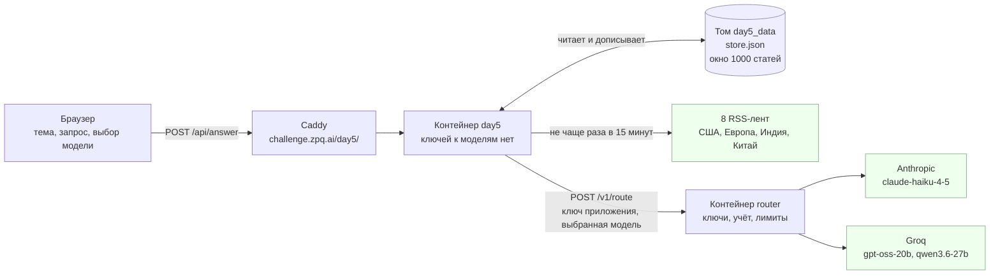
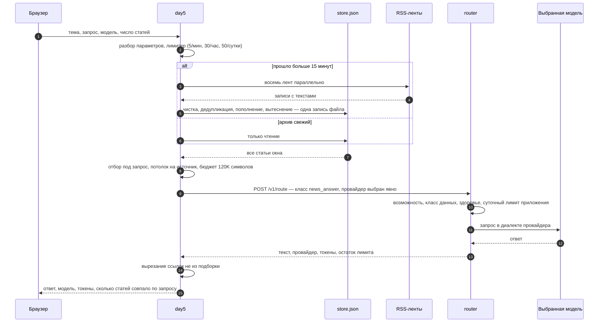
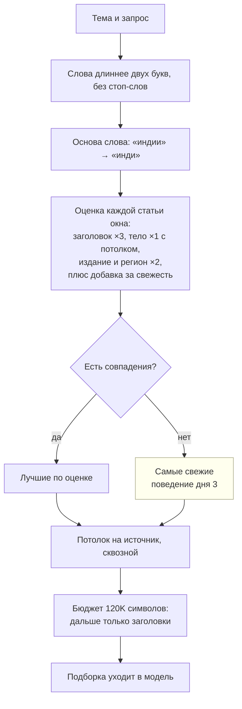
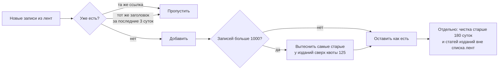

# Как устроен день 5

Схемы к приложению `days/day5/`. Решения — ADR `2026-09-08-1825-day5-article-archive.md`
(архив и отбор) и `2026-09-08-1824-explicit-model-choice.md` (выбор модели).
Эксплуатация — `operations.md`.

## Что где живёт

Ключей к моделям у дня нет: он предъявляет роутеру ключ приложения, а роутер
держит секреты провайдеров, ведёт журнал расхода и суточные лимиты. Поэтому
стрелки к Anthropic и Groq выходят только из роутера.

## Что происходит за один запрос

Фолбэка на другую модель нет: пользователь выбрал модель, и ответ обязан
прийти от неё либо не прийти вовсе.

## Как отбираются статьи

Совпадение засчитывается только с начала слова, поэтому «акци» не находится
в «реакции». Однокоренные слова основа всё же связывает — «банки» найдут
«банкротство»: это названная цена префиксного сравнения.

## Как устроено окно архива

Квота нужна потому, что TechCrunch даёт десятки статей в сутки, а Pandaily —
единицы: без квоты плодовитые издания вытеснили бы регионы. Срок хранения и
удаление вместе с лентой делают исполнимым обещание в футере страницы —
издание может попросить убрать свою ленту.

## Границы, которые видно на схемах

- Первый запрос после паузы ждёт загрузки восьми лент: обновление синхронное,
  фоновой таймер отклонён сознательно.
- Русский запрос по английским текстам держится на основе слова и на
  метаданных издания и региона; при нуле совпадений отбор вырождается
  в самые свежие, а число совпавших статей показано пользователю.
- Архив — чужие тексты на нашем диске. Их объём ограничен окном, возрастом
  и списком лент, но приложение остаётся их хранителем.
